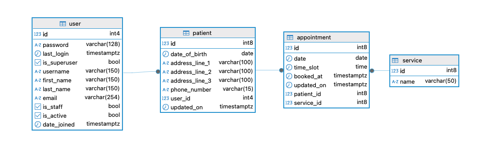
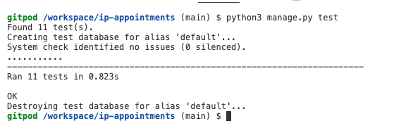
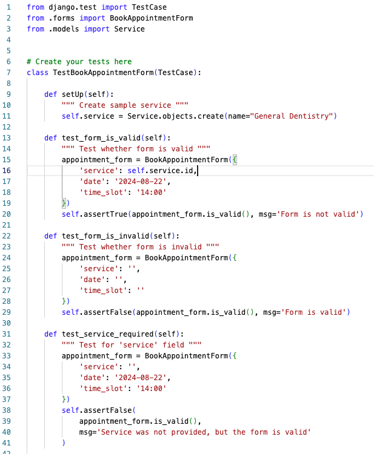
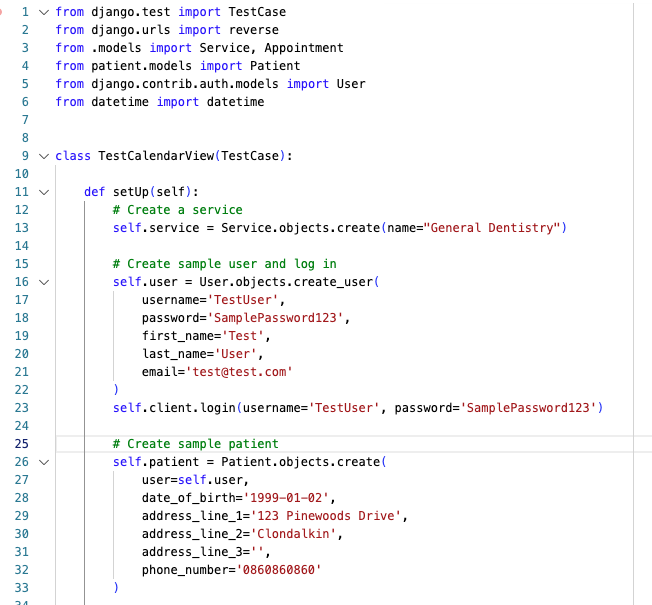
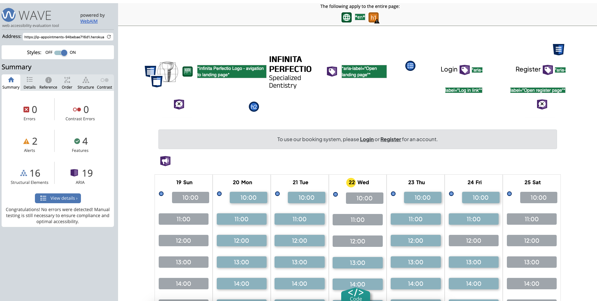
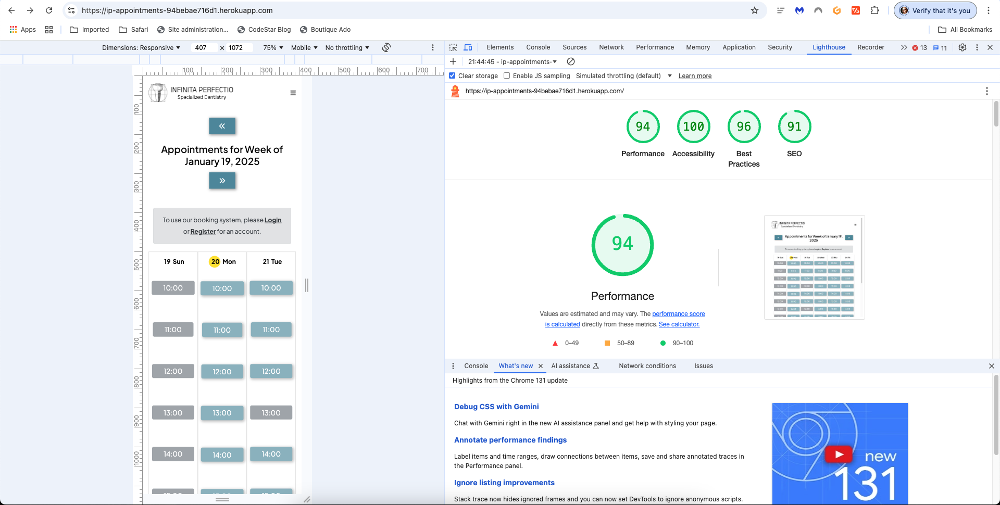
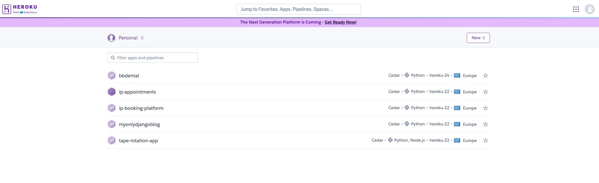
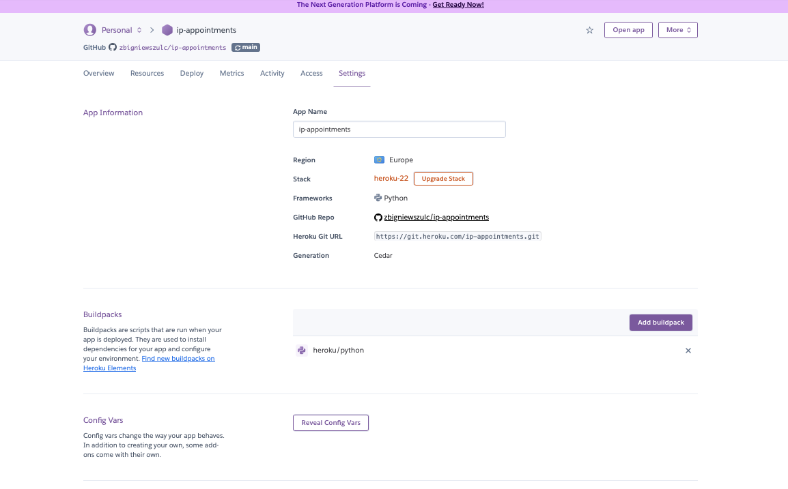
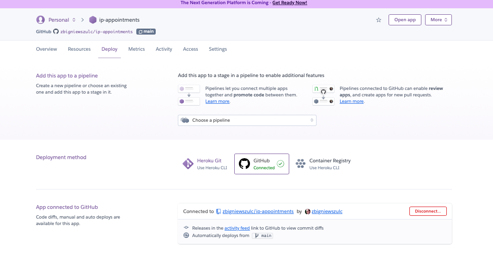
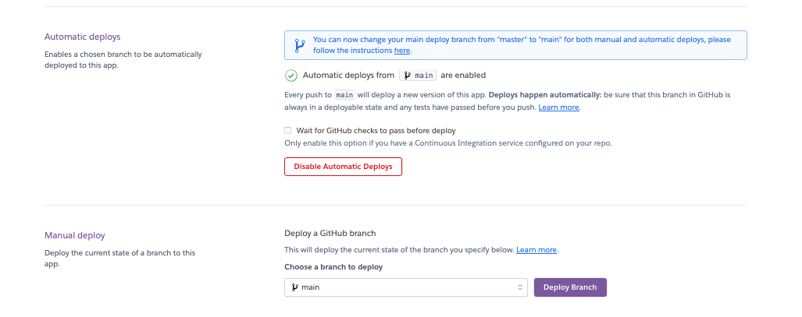

# Infinita Perfectio Booking Platform
The Infinita Perfectio Booking Platform was designed as an add-on to an existing website for a Polish dental clinic, with the aim of encouraging clients to book dental treatments online. Potential clients can review available times and dates and proceed with booking their desired treatment.
To access the booking platform, the customer will be prompted to log in or register first. Upon registration, the customer will be able to book treatments, cancel existing bookings, and amend their personal details provided during registration. The administrator will have the option to create, amend, and delete appointment listings as well as manage the offered treatments, which are also referred to as services interchangeably. The system includes several features to prevent typical errors. For example, a warning message will appear if a client selects a timeslot in the past. Timeslots that have already been booked are grayed out and not accessible. Additionally, confirmation emails are sent to notify clients of appointment changes, such as cancellations, and verification emails.

* Link to the hosted project: **[Infinita Perfectio Booking Platform](https://ip-appointments-94bebae716d1.herokuapp.com)**

## Features

1. **Navigation Bar**  
The navigation bar appears on all pages, with different links displayed depending on the page and the user. It allows users to easily navigate between pages across all devices without the need to use the browser's 'back' button to return to the previous page.
The navigation bar includes various links depending on the page and user:
To the Home Page, Login, and Register for users who do not have their account yet.
To the Home Page, My Appointments, My Details, and Logout for signed-in users.
To the Home Page, Dental Services, and Logout for the administrator, also called superuser in the context of this web app.  

* Default navigation bar:

* When patient logged in

* When administrator logged in:
  

* On mobile devices:

1. **The Footer**  
The footer bar appears on all pages, allowing user to easily access the clinic's Facebook page, make a phone call through WhatsApp, or view the opening hours.

3. **Calendar Page (The Landing Page)**  
The landing page displays the navigation bar, the footer, and the calendar with available dates and times. Timeslots highlighted in grey are already booked and therefore not available. The user has the option to switch between different dates and weeks using the arrow buttons and can return to the current week by clicking the return (go to current week) button. The customer is prompted to log in or register to access the booking option.
The navigation bar includes links to the Home Page, Login, and Register.

* Calendar's navigation buttons:

4. **Registration Page**  
The sign-up form is displayed. A reminder to sign in for clients who are already registered is shown at the top of the form. Fields highlighted with an asterisk are mandatory, and a warning will appear if they are left blank. There is additional information regarding password requirements at the bottom of the form. Once all fields are completed correctly and the "Sign Up" box is ticked, the system will send an account verification email to the address provided by the customer. To access the account, the customer must confirm the email.  
The navigation bar includes links to the Home Page, Login, and Register.

* Verification Email:

5. **Login Page**  
Upon opening, a sign-in form is displayed. The customer or administrator is required to provide their username and password to sign in. An error message will be displayed if an incorrect username or password is entered. Upon signing in, a small green confirmation box will appear in the bottom right corner, confirming successful sign-in. Additionally, there is an option to click the "Remember Me" box for future sign-ins , a link to open the Registration page and password recovery functionality.
The navigation bar includes links to the Home Page, Login, and Register.

* Password reset functionality:

1. **Customer Login**  
**Landing Page** – The calendar, showing available dates and timeslots, is displayed. The customer's username is also shown in the navigation bar for confirmation. The current day is highlighted in yellow, and unavailable slots are greyed out. A warning message will appear if a time slot selected is in the past.
The customer can navigate through dates using the arrow buttons. Upon clicking on a desired timeslot, a popup window will appear confirming the date and time, along with a dropdown list of available services, also referred to as treatments. Once the customer confirms the booking, a small green box with an acknowledgment will appear in the bottom right corner of the page.  

**My Details** – Upon clicking the "My Details" link, the customer can view and edit their details saved in the system. Once an update is saved, an acknowledgment box will appear on the screen.  

**My Appointments** – This page displays all the details of appointments booked by the customer. Each appointment can be deleted by clicking the "Delete" button next to the appointment details. A warning message will appear on the screen asking the client to confirm the cancellation. Upon confirmation, an acknowledgment box will appear on the screen.   

**Logout** – Upon clicking the "Logout" link, a sign-out window will appear, and the client will be prompted to confirm if they wish to log out.  

**Home Page** – Upon clicking the logo, the client will be redirected to the landing page.

7. **Administrator Login**  
**Landing Page** – Upon logging in, the landing page with the calendar is displayed. The administrator’s username is also shown in the navigation bar.  
The navigation bar includes the following links:  
**Dental Services** page – This page offers CRUD functionality, allowing the administrator to view, add, amend, and delete treatments (services) available in the calendar. All changes made by the administrator are implemented immediately and reflected in the calendar.  
**Logout** – Upon clicking the "Logout" link, a sign-out window will appear, and the administrator will be prompted to confirm if they wish to log out.

8. **Email**  
Email Confirmation Functionality – The platform also features email confirmation, ensuring key actions, such as account verification, reservations, and updates to those reservations.

1. **Push notifications**  
The platform uses Bootstrap Toasts for push notifications, offering a modern and effective method to deliver real-time updates to users. These notifications are displayed as compact, dismissible pop-ups, in the bottom-right corner of the screen, ensuring they are noticeable while remaining unobtrusive to the user’s workflow.  

## User Sories:

### User Story: Patient Registration

**As a new patient, I can register for an account so that I can book dental appointments online.**

### Acceptance Criteria

- **AC1**: Patient can access the registration page from the navigation bar.  
- **AC2**: Patient must provide required details:  
  - Name  
  - Surname  
  - Date of Birth  
  - Email  
  - Password  
  - Address  
  - Phone Number  
- **AC3**: Patient receives a confirmation email upon successful registration.
---
### User Story: Patient Login

**As a registered patient, I can log in to my account so that I can manage my appointments.**

### Acceptance Criteria

- **AC1**: Patient can access the login page from the navigation bar.  
- **AC2**: Patient must provide their username and password to log in.  
- **AC3**: Patient sees an error message if login credentials are incorrect.  
- **AC4**: In case of a forgotten password, the patient must have the option to reset it.
---
### User Story: View Calendar

**As a logged-in patient, I can view a calendar with available time slots so that I can select a time for my dental appointment.**

### Acceptance Criteria

- **AC1**: The calendar displays the current week with available time slots.  
- **AC2**: Booked time slots are greyed out.  
- **AC3**: The current date is clearly highlighted.
---

### User Story: Book Appointment

**As a logged-in patient, I can book an available time slot so that I can schedule a dental appointment.**

### Acceptance Criteria

- **AC1**: Patient can select an available time slot, triggering a modal asking for confirmation.  
- **AC2**: Patient can confirm or cancel the booking from the modal.  
- **AC3**: Patient cannot book the appointments from the past.  
- **AC4**: Only one visit allowed per reservation. No double bookings accepted.
---

### User Story: Cancel Appointment

**As a logged-in patient, I can cancel a booked appointment so that I can free up the date.**

### Acceptance Criteria

- **AC1**: Patient can view their booked appointments under the "My Appointments" section.  
- **AC2**: Patient can cancel an appointment, triggering a confirmation modal.  
- **AC3**: Patient receives a confirmation email upon successful cancellation.
---

### User Story: View Personal Details

**As a patient, I can view my personal details so that I can keep my information up-to-date.**

### Acceptance Criteria

- **AC1**: Patient can view their username, first name, last name, email, phone number, address, and date of birth.  
- **AC2**: The information should be presented in a user-friendly layout with a button to edit patient details on the same page.
---

### User Story: Edit Personal Details

**As a user, I can edit my personal details so that I can keep my details up-to-date.**

### Acceptance Criteria

- **AC1**: User can edit their first name, last name, email, phone number, address, and date of birth.  
- **AC2**: Username is not allowed to be changed.  
- **AC3**: A success message should show up following a submission, and the updated details should be stored in the database.
---

### User Story: Add or remove Dental Services

**As a superuser, I can add or remove dental services so that the list of services offered is up-to-date.**

### Acceptance Criteria

- **AC1**: Superuser can manage services through the admin site.  
- **AC2**: Added new services should appear in the booking form on the front end.  
- **AC3**: Removed services should no longer appear in the booking form on the front end.
---

### User Story: Dental Services menu option for superuser

**As a superuser/administrator, I can display a list of all available dental services so that I can manage the clinic's service offerings.**

### Acceptance Criteria

- **AC1**: An option labeled "Dental Services" should be visible in the navigation menu for administrators/superusers.  
- **AC2**: Clicking the "Dental Services" option should display a full list of all services.  
- **AC3**: Only administrators and superusers who are logged in should be able to see the "Dental Services" menu item.
---

### User Story: Superuser Manage Dental Services

**As a superuser/administrator, I can manage dental services on the front end so that the offered options for booking are up to date and easier to manage.**

### Acceptance Criteria

- **AC1**: **Create New Service** - The superuser/administrator can add new dental services with details like the name of the offered service. It should be available for booking once created.  
- **AC2**: **Update Existing Service** - The superuser/administrator can edit the details of existing dental services.  
- **AC3**: **Delete Existing Service** - The superuser/administrator can remove services that are no longer offered. The deleted service should not be available as a dropdown option on the calendar page. Also, deleted services should cascade and delete all booked appointments connected with the deleted service.

## Data Model

The data model behind the Infinita Perfectio Booking Platform is designed to handle the core functionalities of managing users, appointments, and treatments. It includes several key components that work together to ensure smooth operations for both patients and administrators.

- **User Model:** This model manages the details of both patients and administrators, including their personal information and login credentials. It also defines user roles, helping to differentiate the permissions for patients and administrators.
- **Appointment Model:** This model stores all the information about the booked appointments, such as the time, date, patient and selected treatment.
- **Service Model:** Here, we store the details of the dental treatments offered by the clinic. Each service is described simply by the name.

Overall, this structure supports efficient data management, making the booking process seamless for patients while giving administrators the flexibility to update services and manage appointments effectively.
* ER Diagram

## The Skeleton Plane

* Landing Page

* Landing Page For Logged In User

* Landing Page For Logged In Administrator

## Testing

### Validator Testing
* HTML
  * There were three errors returned when passing through the official [ W3C validator](https://validator.w3.org/)

**All errors have been fixed:**

* CSS
  * No errors were found when passing through the official [W3C validator](https://jigsaw.w3.org/css-validator/)

* JavaScripy
  * appointment.js - No errors found

 

 * cancel_appointment.js - No errors found

* toast.js - No errors found

* Python (I have used Code Instittue recommended [CI PythonLinter](https://pep8ci.herokuapp.com))
  * **Appointment app**
    * forms.py - 3 errors found. All have been fixed

    * views.py  - 52 errors found. All have been fixed.

  * models.py  - 18th errors found. All have been fixed.

  * **Patient app**
    * models.py - 3 errors found. All have been fixed

    * views.py - 46 errors found. All have been fixed

**I have scanned all Python files in the project using the CI Python Linter. No errors were detected except for the issues mentioned above, which have since been resolved.**

### Manual Testing  

The Infinita Perfectio Booking Platform was thoroughly tested to ensure all its features work correctly across various scenarios. The testing process included the following steps:  

## Navigation Bar  
* Checked that the navigation bar links (Home, Login, Register, My Appointments, etc.) direct users to the correct pages based on their login status (guest, customer, or administrator).  
* Tested the navigation bar’s responsiveness on different screen sizes, including desktops, tablets, and mobile devices.  

## Calendar Page  
* Verified that users can only select future timeslots and that attempts to select past timeslots trigger a warning message.  
* Confirmed that unavailable timeslots are grayed out and cannot be selected.  
* Tested the calendar navigation buttons to ensure smooth functionality when moving between weeks or returning to the current week.  

## Registration and Login  
* Ensured that required fields on the registration page are validated and display error messages if left blank.  
* Tested the email verification process to ensure users cannot log in without confirming their accounts.  
* Checked that unsuccessful login attempts produce appropriate error messages and successful logins display confirmation messages.  

## Booking Process  
* Verified that users can book appointments by selecting a date, time, and service.  
* Tested the confirmation popup to ensure it provides accurate details before finalizing the booking.  
* Confirmed that successfully booked appointments appear correctly in the "My Appointments" section.  

### Customer Account  
* Checked the functionality of the "My Details" page, ensuring customers can view and update their information without issues.  
* Verified that customers can view and cancel appointments in the "My Appointments" section, with confirmation prompts appearing as expected.  

### Administrator Features  
* Tested the "Dental Services" page to ensure administrators can create, update, and delete services.  
* Verified that any changes made by the administrator are reflected immediately in the calendar.  
* Confirmed that administrators can view the calendar and log out successfully but cannot book appointments themselves.  

## Responsive Design  
* Ensured the platform’s layout and features work seamlessly on various devices, including desktops, tablets, and smartphones.  
* Checked the usability of all elements, such as navigation bars, forms, and buttons, on smaller screens.  

## Notifications  
* Tested Bootstrap Toast notifications to confirm they display correctly for actions like logging in, booking, and canceling appointments.  
* Verified that the notifications are user-friendly, dismissible, and visible across different devices.  

## Error Handling  
* Simulated user errors such as invalid login credentials, blank registration fields, and selecting past timeslots. Verified that the system responds with clear error messages.  
* Tested inputs such as invalid email formats and weak passwords to confirm proper validation.  

### Cross-Browser Compatibility  
* Tested the platform on multiple browsers, including Chrome, Firefox, Edge, and Safari, to ensure consistent functionality and appearance.  

## Email Notifications  
* Verified that email notifications for account verification, booking confirmation, and cancellations are sent to the user’s registered email address.  
* Ensured that the email content is clear and accurate, containing all the necessary information.  

Overall, the testing process confirmed that all features are functioning as intended, with no unresolved issues or bugs.  

### Automated Testing  

* I conducted automated testing for Python in my Django project using built-in Unit Tests. All created automated tests passed successfully

* Snippet of appointment bookin form testing 

* Snippet of calendar view testing 

### Unfixed Bugs
* I encountered a few bugs in this project, but all of them were addressed and resolved, leaving no issues remaining.

### Accessibility Evaluation

Aaccessibility testing was performed using the [Wave](https://wave.webaim.org) website - evaluation tool:
  * No errors were found 

### Lightouse testing
  * Automated tool used to improve the quality of web pages. It provides a comprehensive audit of a website’s performance, accessibility, best practices 
  

### Deployment

## Deployment

Follow these steps for a seamless deployment of your application on Heroku.

1. **Log in to Heroku**: Head over to the [Heroku Dashboard](https://dashboard.heroku.com/) and log in using your credentials.
   

2. **Create a New Heroku App**: Click on the "New" button, then choose "Create new app". Provide a unique name for your app, and Heroku will generate a URL to access it.
   
3. **Set Environment Variables**: Go to the settings page of your app on the Heroku dashboard. In the "Config Vars" section, you can define key-value pairs for your environment variables like API keys or database connection URLs. You might need to click Reveal Config Vars to review and set enviroemtnal variables
   

4. **Deploy Your App**: Under the "Deploy" tab of your Heroku app, you'll have several options to deploy manually or link your app to a GitHub repository for automated deployments. Select the method that aligns with your workflow. If you choose automatic deployment, configure it to deploy your app every time there are changes in the linked GitHub repository.
   

## Credits
https://dbdiagram.io/d/Appointments-669307ca9939893daedb11c8
https://docs.djangoproject.com/en/5.0/topics/db/queries/
https://docs.djangoproject.com/en/5.0/topics/db/queries/#lookups-that-span-relationships
https://docs.djangoproject.com/en/5.0/ref/forms/widgets/
https://medium.com/@altafkhan_24475/part-7-built-in-widgets-in-django-form-2d15fdef8e5e
https://docs.allauth.org/en/latest/account/forms.html
https://docs.djangoproject.com/en/5.0/topics/forms/modelforms/
https://gavinwiener.medium.com/modifying-django-allauth-forms-6eb19e77ef56
https://www.geeksforgeeks.org/python-extending-and-customizing-django-allauth/
https://simpleisbetterthancomplex.com/tutorial/2018/11/28/advanced-form-rendering-with-django-crispy-forms.html
https://docs.allauth.org/en/latest/account/forms.html#signup
https://docs.djangoproject.com/en/5.0/topics/forms/
https://docs.djangoproject.com/en/5.0/ref/forms/validation/
https://docs.bird.com/connectivity-platform/how-to-guides/how-to-create-complex-regular-expressions-regex-conditions
https://docs.djangoproject.com/en/5.0/ref/contrib/messages/
https://testdriven.io/tips/9329fe4a-605d-4c73-b254-d79542925b81/
https://simpleisbetterthancomplex.com/tutorial/2017/02/18/how-to-create-user-sign-up-view.html
https://medium.com/django-unleashed/configuring-smtp-server-in-django-a-comprehensive-guide-91810a2bca3f
https://www.twilio.com/docs/sendgrid/for-developers/sending-email/django#twilio-docs-content-area
https://docs.djangoproject.com/en/5.0/topics/email/
https://www.squash.io/how-to-use-settimeout-for-delaying-jquery-actions/
https://docs.djangoproject.com/en/1.8/ref/contrib/sites/
https://medium.com/@princesamuelpks/mastering-djangos-secret-weapon-context-processors-unveiled-f0c2e7ea8f43
https://docs.djangoproject.com/en/5.0/ref/contrib/sites/
https://docs.allauth.org/en/latest/account/configuration.html
https://docs.allauth.org/en/latest/account/signals.html
https://docs.djangoproject.com/en/5.0/topics/signals/
https://medium.com/jungletronics/how-django-signals-work-81dc30d0dad5
https://www.sitepoint.com/understanding-signals-in-django/
https://dev.to/yokwejuste/django-signals-mastery-144d
https://www.guvi.in/blog/guide-for-django-signals-and-their-uses/
https://docs.djangoproject.com/en/5.0/topics/i18n/timezones/
https://docs.python.org/3.12/library/calendar.html
https://docs.djangoproject.com/en/5.0/topics/db/models/
https://docs.djangoproject.com/en/5.0/ref/models/querysets/
https://docs.djangoproject.com/en/5.0/ref/models/querysets/#values-list
https://docs.python.org/3.12/library/datetime.html#strftime-strptime-behavior
https://docs.djangoproject.com/en/5.0/ref/request-response/#jsonresponse-objects
https://www.w3schools.com/python/ref_string_endswith.asp
https://toolstud.io/web/charmap.php
https://docs.djangoproject.com/en/5.0/ref/templates/builtins/
https://sphinxcontrib-napoleon.readthedocs.io/en/latest/example_google.html
https://docs.python.org/3.12/library/exceptions.html
https://docs.djangoproject.com/en/5.0/ref/exceptions/
https://dev.to/kuba_szw/django-logging-forget-about-print-when-debugging-3g11
https://www.w3schools.com/css/tryit.asp?filename=trycss_form_button
https://docs.djangoproject.com/en/5.0/topics/auth/default/
https://docs.python.org/3.12/library/datetime.html#strftime-and-strptime-behavior
https://docs.djangoproject.com/en/1.10/topics/logging/#topic-logging-parts-loggers
https://docs.djangoproject.com/en/4.2/ref/templates/builtins/#ref-templates-builtins-tags
https://docs.python.org/3.12/library/datetime.html#module-datetime
https://www.freecodecamp.org/news/python-for-loop-for-i-in-range-example/
https://docs.djangoproject.com/en/5.0/topics/http/urls/ -> converters
https://tech.raturi.in/designing-django-urls-best-practices
https://medium.com/jungletronics/how-django-signals-work-81dc30d0dad5
https://docs.djangoproject.com/en/5.0/ref/models/class/
https://docs.djangoproject.com/en/5.0/topics/testing/
https://docs.djangoproject.com/en/5.0/topics/testing/tools/
https://developer.mozilla.org/en-US/docs/Web/API/Document/querySelectorAll
https://www.freecodecamp.org/news/how-to-loop-through-an-array-in-javascript-js-iterate-tutorial/
https://www.w3schools.com/js/js_string_templates.asp
https://www.w3schools.com/jsref/met_document_queryselectorall.asp
https://www.w3schools.com/jsref/met_document_queryselector.asp
https://developer.mozilla.org/en-US/docs/Web/API/Document/DOMContentLoaded_event
https://docs.djangoproject.com/en/5.1/ref/templates/builtins/ 
https://docs.djangoproject.com/en/5.1/topics/i18n/timezones/
https://docs.djangoproject.com/en/5.0/topics/http/shortcuts/
https://stackoverflow.com/questions/63511542/modelform-crispy-formhelper-and-choices-list-datepicker-not-showing
https://docs.djangoproject.com/en/5.0/topics/forms/modelforms/
https://www.geeksforgeeks.org/django-convert-form-errors-to-python-dictionary/

Throughout this project, I relied on a wide range of resources that enabled me to achieve my goals and ensure the application functioned as intended. The foundation of my work was the Code Institute training materials, which provided invaluable knowledge and guidance at every stage of development.
I also utilized ChatGPT, which was incredibly helpful in clarifying complex concepts and deepening my understanding of coding principles. This support allowed me to effectively address challenges and enhance my problem-solving skills.
I am sincerely grateful for all the tools, documentation, and support that contributed to the successful completion of this project. A special thanks goes to the team at Code Institute, whose dedication and expertise played a vital role in my learning journey.
